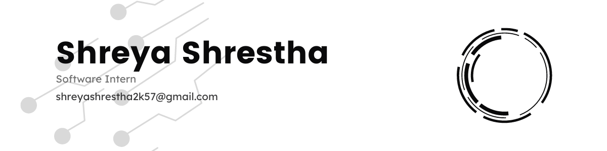

 

# Hello!!!! :wave: :wave:

My name is **Shreya Shrestha**.:smile::smile: from Kathmandu Nepal.

## Description
:computer: I am a front-end developer with a strong understanding of HTML, CSS, CSS frameworks, JavaScript, and React, who is passionate about continuous learning of new technologies and proficient in creating responsive user interfaces.

:computer: I also possess knowledge of Oracle BI Publisher and SQL, enabling me to generate Excel and RTF reports.

:mobile: Additionally, I have also worked on Flutter projects.

:book: Studied BSc.CS at Kathmandu University, Dhulikhel Nepal.

:nerd_face: I love reading novel.

:computer: Worked as Software Intern at LIS Nepal

 
 

 

## :computer: Skills: 

  

  

#### :computer: Additional Skills

 
 
 
 
 
 
 
 

## :computer: Tools

  

<!-- Contact -->

## Connect with me

    
    &nbsp; &nbsp;
    
    &nbsp; &nbsp;
    

 

  

 

 
 
